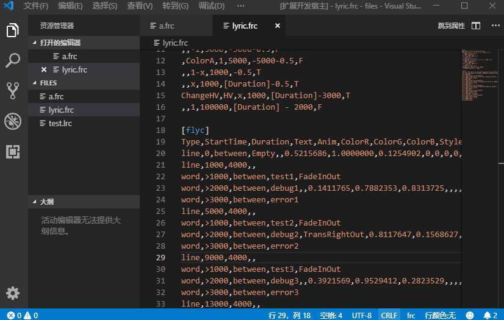

# flyric README

这是`flyric`的vscode插件说明文档。

## Features

简单的预览



中英文支持，支持蹩脚英文。

- 支持从LRC歌词的快速转换 **LRC文件必须使用UTF-8编码**
- 支持一个csv表格格式到歌词的快速转换，可以使用其它软件快速打时间轴
- 语法高亮支持
- 鼠标悬停显示属性值
- 属性间快速跳转
- 字体颜色快速编辑

## Requirements

无第三方依赖

## 从Release安装

可以从[Github release](https://github.com/frto027/flyric-vscode/releases/)下载最新的发布版本

假定下载的文件为`flyric-0.0.1.vsix`，使用下面的指令安装
```s
code --install-extension flyric-0.0.1.vsix
```
另外，如果觉得插件没有用了，还可以这样卸载它：
```s
code --uninstall-extension frto027.flyric
```
建议切换vscode语言为中文，上面的code指令需要安装vscode时勾选添加到PATH环境变量的相关选项才能使用。
```
可以在VSCode市场中安装Chinese(Simplified)Language Pack，重启后自动切换中文
也可以通过Ctrl+Shift+P输入Configure Display Language来进行切换
```
## 编译运行插件

除上面的方式外，也可以从源代码编译运行插件，在debug模式下运行插件需要安装nodejs和vscode，下面的步骤假定你安装了这两个软件  
你可以这样运行插件：  
以windows为例  
首先下载解压这个git的内容，并cd到git所在目录，如果你安装了git，可以在某个文件夹右键"Git Bash Here"，然后输入：
```s
git clone git@github.com:frto027/flyric-vscode.git
cd flyric-vscode
```
之后务必执行node的初始化命令：
```s
npm install
```
最后执行下面的指令打开vscode：
```s
code .
```
在vscode中，可以使用F5来启动测试

## Extension Settings

可以在`文件>首选项>设置>扩展>Flyric`下面找到这个扩展的设置选项

扩展有以下设置选项:

### flyric.convert.*
这些选项设置转换器的输出格式，转换器是用来将lrc或其他格式歌词转换为frc歌词的。
* `flyric.convert.LineStartTime`: 每行开始时间的计算方式
* `flyric.convert.LineDuration`: 每行持续时间的计算方式
* `flyric.convert.NodeStartTime`: 每个节点开始时间的计算方式
* `flyric.convert.NodeDuration`: 每个节点持续时间的计算方式


## Known Issues

- 一个段如果出现空白行，则后面的内容不会识别。
- 切换行颜色功能后，需要改动一下文档或者重新打开文档才能生效
## Release Notes

### 0.0.1

- github发布一个Release，alpha版本

### 0.0.0

- 右键一个`.lrc`文件可以快速转换为`.frc`歌词格式
- 在`.frc`文件中右键一段`.lrc`的内容可以转换为符合该文件属性排版的`.frc`歌词格式
- 鼠标悬浮在某一个属性上时可以快速查看属性的值
- 光标位于某一个属性上时可以高亮相邻的同属性和属性名称
- 点击`跳到属性`按钮或`ctrl+shift+j`可以快速在属性之间跳转
- 可以开启或关闭`行颜色显示`，支持快速编辑歌词行颜色
- 现在支持从约定的一个`csv`格式转换为支持的`flyc`格式段了
